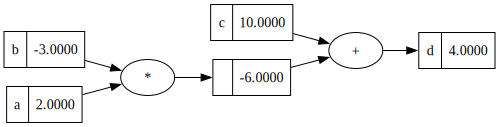

# minion


<!-- WARNING: THIS FILE WAS AUTOGENERATED! DO NOT EDIT! -->

This file will become your README and also the index of your
documentation.

## Install

``` sh
pip install minion
```

## How to use

Fill me in please! Don’t forget code examples:

``` python
from minion.core import Value
from minion.utils import draw_dot
```

``` python
a = Value(2.0, label="a")
b = Value(-3.0, label="b")
c = Value(10.0, label="c")

d = a*b+c; d.label = "d"
d
```

    Value(d|data=4.0)

``` python
draw_dot(d)
```


